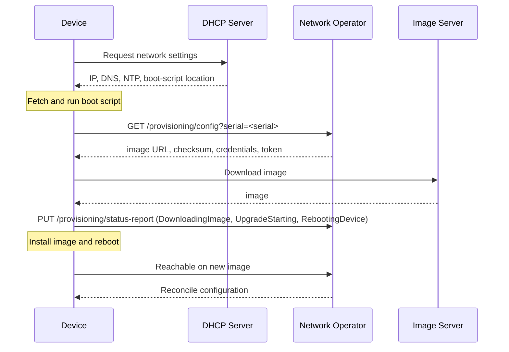
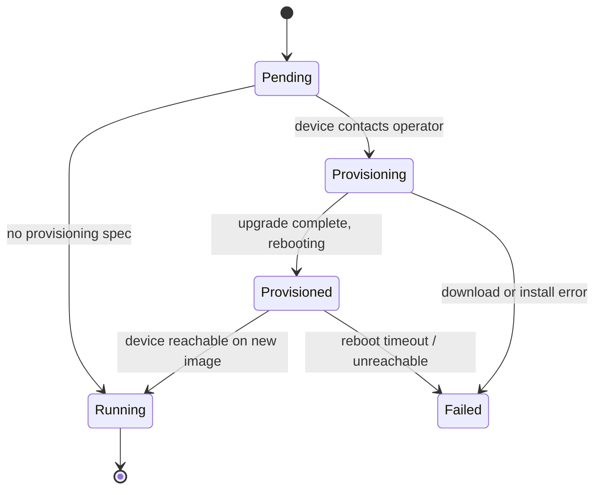

# Device Provisioning

The network operator can bootstrap a device automatically on first boot, from initial network configuration through OS image upgrade and final handoff to the operator. This page describes the platform-agnostic provisioning contract: the `Device` resource, the lifecycle phases, the HTTP endpoints a device talks to, and the provider hook interface a new platform must implement.

Platform-specific mechanics (how the device obtains and runs the boot script, which on-device commands perform the upgrade, which password hash formats are supported) live on the per-platform pages. For Cisco NX-OS see [Zero-Touch Provisioning for Cisco NX-OS](ztp-nxos.md).

## Overview

Provisioning is driven by a small boot script that runs on the device early in its boot sequence, before it has any operator-managed configuration. The script speaks HTTP(S) to the operator's provisioning server: it identifies the device by serial number, receives an image URL, credentials and a token, then downloads and installs the image and reports progress back. Once the device reboots onto the target image and becomes reachable, the operator takes over and reconciles the device's configuration resources.

Because any platform can supply its own boot script and its own provider implementation, the operator side of this contract stays the same across vendors. What differs per platform is packaged behind the provider hook interface described below.

The design rests on an explicit assumption: provisioning works on any vendor's device that can (a) run a boot script early in its boot sequence which is able to configure the device, and (b) reach the operator over HTTP(S). Platforms that meet these two requirements can plug in to the operator-side contract.

Provisioning is currently implemented only by the Cisco NX-OS provider (see [Zero-Touch Provisioning for Cisco NX-OS](ztp-nxos.md)). The contract described here is the interface a future platform provider would implement.

The overall flow, independent of platform, looks like this:



The DHCP server must hand out, at minimum, a management IP address, DNS and NTP servers, and a pointer to where the boot script can be fetched (for example a TFTP path). The exact option used to convey the boot-script location and the protocol used to fetch it are platform specific.

## Device resource

A `Device` opts into provisioning by setting `spec.provisioning`:

```yaml
apiVersion: core.network-operator.io/v1alpha1
kind: Device
metadata:
  name: spine-01
  namespace: fabric
  labels:
    networking.metal.ironcore.dev/device-serial: "9vt9ohzbc3h"
spec:
  endpoint:
    address: "192.0.2.10:830"
    secretRef:
      name: spine-01-credentials
  provisioning:
    image:
      url: "http://image-server.example.com/image.bin"
      checksum: "d41d8cd98f00b204e9800998ecf8427e"
      checksumType: MD5
    bootScript:
      configMapRef:
        name: boot-script
        key: script
```

The `provisioning.image` section tells the operator which image the device should run. When the boot script contacts the operator, this is what gets returned in the config response.

The `provisioning.bootScript` holds the boot script the device runs, supplied inline or from a referenced Secret or ConfigMap. The operator ships an optional built-in TFTP server (beta) that serves this script directly: the device requests a filename encoding its serial (`serial-<serial>` or `<serial>.<ext>`), the server resolves the matching `Device`, reads `spec.provisioning.bootScript`, and returns its contents as-is. With source validation enabled it also checks that the client IP matches the device endpoint and the serial matches `status.serialNumber`. If you already run your own TFTP infrastructure, delivery can stay external to the operator instead.

If `spec.provisioning` is omitted, the device skips straight from `Pending` to `Running`.

## Lifecycle phases



| Phase | Description |
|-------|-------------|
| `Pending` | Device resource created, waiting for the device to contact the operator |
| `Provisioning` | Boot sequence in progress (image download, upgrade, reboot) |
| `Provisioned` | Upgrade complete, device rebooting into new image |
| `Running` | Device reachable on new image; operator is applying configuration |
| `Failed` | Provisioning failed; see `status.provisioning[].error` |

The `status.provisioning` list records each provisioning attempt with its start time, reboot time, and any error message.

## HTTP provisioning API

The operator exposes an HTTP provisioning server with four endpoints. Every call carries a `serial` query parameter identifying the device (see [Device identification](#device-identification) below).

### Device identification

Provisioning is keyed on the device serial number. Every provisioning request supplies the serial, and the operator resolves it to a `Device` by matching it against the `networking.metal.ironcore.dev/device-serial` **label**. This means:

- The serial must be present as the `networking.metal.ironcore.dev/device-serial` label on the `Device`; a `Device` without it cannot be matched to an incoming provisioning request.
- The serial must be **unique** across the cluster. If two `Device` objects carry the same serial label the request is rejected, since the operator cannot tell which one to provision.
- The label is set automatically by the device controller from `status.serialNumber` once the operator has observed the device. For a first-boot device that the operator has never reached, set the `networking.metal.ironcore.dev/device-serial` label on the `Device` up front so the initial provisioning request can be resolved.

### Source validation

Source validation is optional and off by default. It is enabled per server via controller-manager flags:

- `--provisioning-http-validate-source-ip` for the HTTP server.
- `--tftp-validate-source` for the built-in TFTP server.

When enabled, the operator additionally verifies that a request genuinely originates from the device's known management address:

- HTTP endpoints: the request's client IP must match the host portion of the device's `spec.endpoint.address`. A mismatch is rejected with `403`.
- Built-in TFTP server: the client IP must match the device endpoint IP, and the serial encoded in the requested filename must match `status.serialNumber`.

Enable it only once devices reach the operator from their known management addresses; otherwise legitimate first-boot requests behind NAT or on a different source address will be rejected.

### `GET /provisioning/config`

Called first by the boot script. The operator looks up the device by serial, mints a provisioning token on the first call, reads the admin credential from the device's endpoint Secret, and responds with:

```json
{
  "provisioningToken": "<token>",
  "image": {
    "url": "http://image-server.example.com/image.bin",
    "checksum": "d41d8cd98f00b204e9800998ecf8427e",
    "checksumType": "MD5"
  },
  "userAccounts": [
    {
      "username": "admin",
      "hashedPassword": "<hashed>",
      "hashAlgorithm": "<algorithm-label>"
    }
  ],
  "hostname": "<device-name>"
}
```

The `hostname` is the `Device` resource name. The `provisioningToken` is used by the device for all subsequent status-report calls so the operator can authenticate progress updates. See [Password handling](#password-handling) for how `hashedPassword` and `hashAlgorithm` are produced.

### `PUT /provisioning/status-report`

The device reports progress. Authenticated with the token from the config response:

```
PUT /provisioning/status-report?serial=<serial>
Authorization: Bearer <token>
```

The operator understands the following status values:

| Status | Meaning |
|--------|---------|
| `DownloadingImage` | Image download in progress |
| `UpgradeStarting` | Checksum verified, install command running |
| `RebootingDevice` | Install complete, rebooting |
| `ImageDownloadFailed` | Download or checksum failure |
| `UpgradeFailed` | Install command failed |

### `GET /provisioning/mtls-client-ca` and `GET /provisioning/device-certificate`

Both are optional. They let the device fetch the operator's mTLS client CA and a per-device certificate so the operator can later connect over an authenticated channel. A device that does not need certificates can ignore these; the operator returns `404` when there is nothing to hand out, which the boot script treats as "skip".

## Provisioning provider interface

A platform plugs into provisioning by implementing `ProvisioningProvider` (`internal/provider/provider.go`):

```go
type ProvisioningProvider interface {
    Reprovision(context.Context, *deviceutil.Connection) error
    HashProvisioningPassword(password string) (hash string, algorithm string, err error)
    VerifyProvisioned(context.Context, *deviceutil.Connection, *v1alpha1.Device) bool
}
```

- `Reprovision` resets the device and re-enables its provisioning mechanism so it can run through the sequence again.
- `HashProvisioningPassword` turns a plaintext password into a device-native hash plus an algorithm label (see below).
- `VerifyProvisioned` checks whether the device has finished provisioning and is running the expected image.

## Password handling

The operator never sends a plaintext password to the device over the provisioning channel. That channel may be unauthenticated or otherwise not fully trusted (the device has not yet been secured, and the operator does not verify the device's identity at this stage), so shipping a cleartext credential over it would be unsafe.

Instead the operator reads the admin credential from the device's endpoint Secret and passes the plaintext to the provider's `HashProvisioningPassword` hook. The hook returns two things: a hash in the device's native on-box format, and an algorithm label identifying which hash format it is.

Both are placed in the config response as `userAccounts[].hashedPassword` and `userAccounts[].hashAlgorithm`. The boot script maps the algorithm label to the platform's corresponding on-device password type and configures the account with the pre-hashed value; the plaintext never leaves the operator.

## Observing provisioning progress

```bash
# Watch the device phase
kubectl get device spine-01 -w

# Full status including provisioning history
kubectl get device spine-01 -o yaml | yq .status

# Conditions only
kubectl get device spine-01 -o yaml | yq .status.conditions

# Events
kubectl describe device spine-01
```
