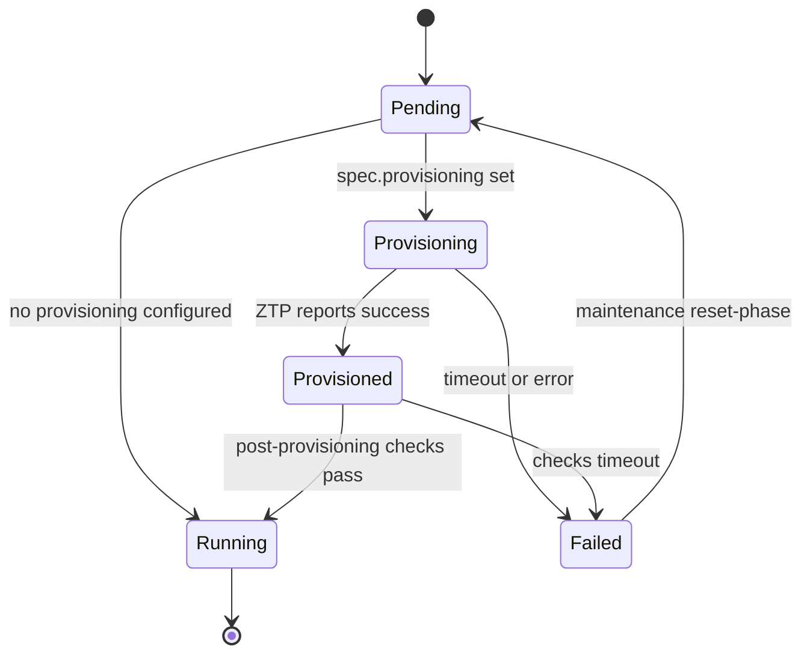
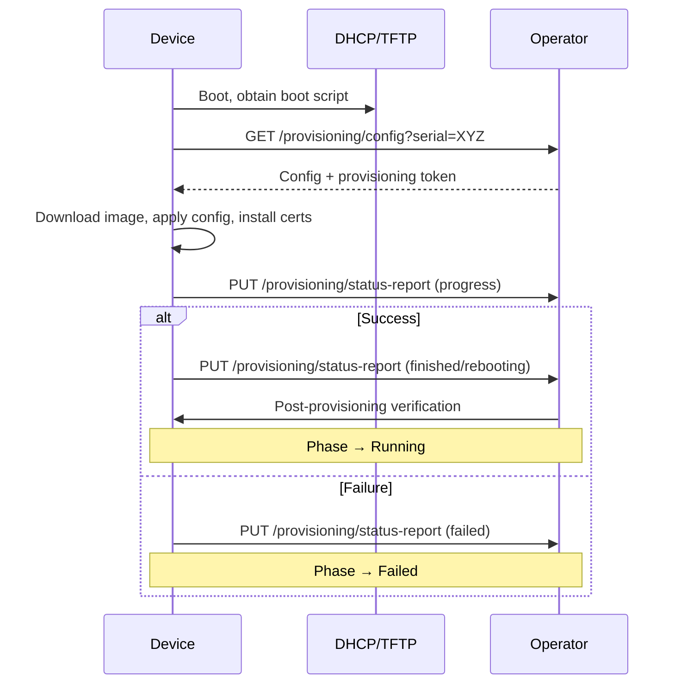

# Device Onboarding Guide

This page covers the end-to-end process of onboarding a network device into
the Network Operator — from prerequisites through Zero Touch Provisioning
(ZTP) to day-2 configuration.

## Prerequisites

Before creating a `Device` resource, ensure:

1. **Network Operator is deployed** in your Kubernetes cluster with a
   compatible provider (e.g. Cisco NX-OS, Openconfig).
2. **Management connectivity** exists between the operator pods and the
   device's management IP. If ZTP is used, the device must also be able
   to reach the operator's HTTP provisioning server.
3. **Credentials secret** is created — a `kubernetes.io/basic-auth` secret
   with `username` and `password` keys:

    ```yaml
    apiVersion: v1
    kind: Secret
    metadata:
      name: device-credentials
    type: kubernetes.io/basic-auth
    stringData:
      username: admin
      password: changeme
    ```

4. **(Optional) TLS certificates** — if your device uses gNMI over TLS, create
   secrets for the CA and (for mTLS) the client certificate.
5. **(Optional) Provisioning image** — if you want ZTP, have the NOS image
   accessible via HTTP/HTTPS with a known checksum.

## Creating a Device

A minimal `Device` resource without ZTP:

```yaml
apiVersion: networking.metal.ironcore.dev/v1alpha1
kind: Device
metadata:
  name: leaf1
  labels:
    topology.kubernetes.io/zone: dc-1a
    networking.metal.ironcore.dev/role: evpn-leaf
spec:
  endpoint:
    address: 192.168.1.10:50051
    secretRef:
      name: device-credentials
```

A `Device` with ZTP provisioning enabled:

```yaml
apiVersion: networking.metal.ironcore.dev/v1alpha1
kind: Device
metadata:
  name: leaf2
spec:
  endpoint:
    address: 192.168.1.11:50051
    secretRef:
      name: device-credentials
    tls:
      ca:
        secretRef:
          name: gnmi-ca
        key: ca.crt
  provisioning:
    image:
      url: http://images.example.com/nxos-10.4.3.bin
      checksum: "abc123..."
      checksumType: MD5
    bootScript:
      configMapRef:
        name: ztp-boot-script
        key: script.sh
```

## Device Lifecycle Phases

Once created, a Device progresses through the following phases:



| Phase            | Description                                                                                                                                                              |
| ---------------- | ------------------------------------------------------------------------------------------------------------------------------------------------------------------------ |
| **Pending**      | Initial state. If `spec.provisioning` is set and the provider supports it, transitions to `Provisioning`. Otherwise skips directly to `Running`.                         |
| **Provisioning** | The device is expected to call the operator's provisioning HTTP endpoints. Times out after 1 hour if no provisioning request is received.                                |
| **Provisioned**  | The ZTP script reported success. The operator waits for any reboot to complete, then runs post-provisioning verification (e.g. confirming the correct firmware version). |
| **Running**      | The device is fully operational. The operator periodically connects, fetches hardware info, port inventory, and reports reachability.                                    |
| **Failed**       | Provisioning timed out or reported an error. Requires manual intervention (see [Maintenance Operations](#maintenance-operations)).                                       |

## Zero Touch Provisioning (ZTP)

When `spec.provisioning` is configured, the operator exposes HTTP endpoints
that the ZTP script must call during bootstrap.

### Provisioning HTTP Endpoints

The operator runs an embedded HTTP server (default port configurable via the
operator deployment). The following endpoints are available:

#### `GET /provisioning/config?serial=<SERIAL>`

The boot script must call this endpoint to retrieve provisioning configuration.

**Source IP validation:** If enabled, the operator verifies that the request
originates from the device's configured `spec.endpoint.address`.

**Response:**

```json
{
    "provisioningToken": "<random-token>",
    "image": {
        "url": "http://images.example.com/nxos-10.4.3.bin",
        "checksum": "abc123...",
        "checksumType": "MD5"
    },
    "userAccounts": [
        {
            "username": "admin",
            "hashedPassword": "$6$...",
            "hashAlgorithm": "SHA512"
        }
    ],
    "hostname": "leaf2"
}
```

The device uses this to download the correct image, set up initial user
accounts, and configure its hostname.

#### `PUT /provisioning/status-report?serial=<SERIAL>`

The ZTP script must call this endpoint to report progress. Requires the
`Authorization: Bearer <provisioningToken>` header obtained from the config
endpoint.

**Request body:**

```json
{
    "status": "<ProvisioningPhase>",
    "detail": "optional description"
}
```

Valid status values:

| Status                           | Effect                                                           |
| -------------------------------- | ---------------------------------------------------------------- |
| `DataRetrieved`                  | Informational — logged as event                                  |
| `ScriptExecutionStarted`         | Informational                                                    |
| `DownloadingImage`               | Informational                                                    |
| `InstallingCertificates`         | Informational                                                    |
| `UpgradeStarting`                | Informational                                                    |
| `ExecutionFinishedWithoutReboot` | **Success** — device moves to `Provisioned`                      |
| `RebootingDevice`                | **Success** — device moves to `Provisioned`, reboot timer starts |
| `ScriptExecutionFailed`          | **Failure** — device moves to `Failed`                           |
| `ImageDownloadFailed`            | **Failure** — device moves to `Failed`                           |
| `UpgradeFailed`                  | **Failure** — device moves to `Failed`                           |

#### `GET /provisioning/device-certificate?serial=<SERIAL>`

Returns the TLS certificate, private key, and CA certificate for the device
(from the associated `Certificate` resource). Used to install mTLS
credentials during ZTP.

Requires `Authorization: Bearer <provisioningToken>`.

#### `GET /provisioning/mtls-client-ca?serial=<SERIAL>`

Returns the CA certificate that the device should trust for mTLS client
authentication (i.e. the CA the operator uses to connect to the device).

Requires `Authorization: Bearer <provisioningToken>`.

### ZTP Flow Summary



## Running Phase — Steady State

Once in `Running`, the operator periodically:

1. **Connects** to the device using the configured endpoint and credentials.
2. **Fetches hardware info** (hostname, manufacturer, model, serial, firmware
   version) — refreshed after each reboot.
3. **Discovers ports** — populates `status.ports` with physical port
   inventory and transceiver info.
4. **Maps Interface resources** — links any `Interface` CR that references
   this device back to the corresponding physical port.
5. **Reports conditions** — sets `Ready=True` and `Reachable=True` when the
   device responds successfully.

If the device becomes unreachable, conditions reflect this but the phase
remains `Running`.

## Configuring the Device (Day-2)

After a Device reaches `Running`, you configure it by creating additional
resources that reference it via `spec.deviceRef`. Each resource type has its
own controller that connects to the device and applies configuration.

Example — creating a loopback interface:

```yaml
apiVersion: networking.metal.ironcore.dev/v1alpha1
kind: Interface
metadata:
  name: leaf2-lo0
spec:
  deviceRef:
    name: leaf2
  name: lo0
  type: Loopback
  adminState: Up
  ipv4:
    addresses:
      - 10.0.0.11/32
```

Example — enabling BGP:

```yaml
apiVersion: networking.metal.ironcore.dev/v1alpha1
kind: BGP
metadata:
  name: leaf2-bgp
spec:
  deviceRef:
    name: leaf2
  asNumber: 65001
  routerId: 10.0.0.11
  addressFamilies:
    ipv4Unicast:
      enabled: true
```

All configuration resources follow the same pattern:

1. Create the resource with `spec.deviceRef.name` pointing to the Device.
2. The resource's controller connects to the device and applies the config.
3. The resource reports its own status conditions independently.

For a complete list of available configuration resources, see the
[API Reference](../api-reference/index.md).

## Maintenance Operations

The operator supports maintenance actions via an annotation on the Device:

```bash
# Reboot the device
kubectl annotate device leaf2 \
  networking.metal.ironcore.dev/maintenance=reboot

# Factory reset (erases config, resets phase to Pending)
kubectl annotate device leaf2 \
  networking.metal.ironcore.dev/maintenance=factory-reset

# Re-trigger ZTP provisioning
kubectl annotate device leaf2 \
  networking.metal.ironcore.dev/maintenance=reprovision

# Reset phase to Pending (recover from Failed without device-side action)
kubectl annotate device leaf2 \
  networking.metal.ironcore.dev/maintenance=reset-phase
```

The annotation is removed automatically after the operation succeeds. Failed
operations are retried on subsequent reconciliations.

## Pausing a Device

Set `spec.paused: true` to stop all reconciliation for a device and its
associated resources. Useful during manual maintenance windows:

```bash
kubectl patch device leaf2 --type merge -p '{"spec":{"paused":true}}'
```

## Troubleshooting

| Symptom                            | Check                                                                                               |
| ---------------------------------- | --------------------------------------------------------------------------------------------------- |
| Device stuck in `Pending`          | Verify `spec.provisioning` is set and the provider supports provisioning.                           |
| Device stuck in `Provisioning`     | Ensure the device can reach the operator's provisioning HTTP port. Check the device serial matches. |
| `Failed` phase                     | Inspect `status.provisioning[].error`. Use `reset-phase` annotation after fixing the root cause.    |
| `Ready=Unknown`, `Reachable=False` | Verify network connectivity, credentials, and TLS configuration.                                    |
| Ports not populated                | Ports refresh after reboot detection. Check `status.lastRebootTime`.                                |
